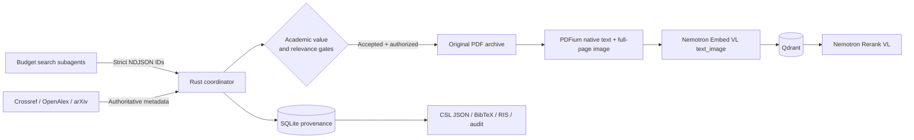

# Academic Literature Mining Skill

A citation-complete, agent-assisted scholarly literature mining system built in
Rust. It discovers academically valuable papers, verifies persistent identifiers,
downloads authorized PDFs, indexes complete PDF pages as native text plus page
images with NVIDIA Nemotron, and stores retrievable evidence in Qdrant.

## Why this project exists

Most literature-search agents optimize for finding plausible titles. That is not
enough for research. This project treats every search result as untrusted until it
has been resolved through a scholarly metadata source and passed explicit quality,
relevance, retraction, citation-completeness, and full-text authorization checks.

Key properties:

- Pure Rust runtime with PDFium-native text and page-image preparation.
- Budget-model subagents perform bounded, read-only candidate discovery.
- Crossref, OpenAlex, arXiv, and optional Semantic Scholar enrichment.
- NVIDIA Build hosted inference with:
  - `nvidia/llama-nemotron-embed-vl-1b-v2`
  - `nvidia/llama-nemotron-rerank-vl-1b-v2`
- Digital PDF pages use their embedded native text plus a complete rendered page
  image; pages without usable text automatically use image-only input.
- Original PDFs, checksums, license assertions, raw metadata, and provenance are
  preserved.
- Qdrant runs through Docker Compose and is bound to localhost by default.
- CSL JSON, BibTeX, RIS, canonical JSONL, and corpus audits are exported.
- SQLite-backed resumable stages make large corpus runs recoverable.

## Architecture



Search workers never receive NVIDIA or Qdrant credentials and never download
papers. The Rust coordinator independently resolves every persistent identifier
before a record can enter the corpus.

## Requirements

- [Rust stable](https://www.rust-lang.org/tools/install) `1.97.1` or newer,
  with Cargo, Clippy, and rustfmt
- Docker with Docker Compose
- An [NVIDIA Build](https://build.nvidia.com/) API key
- An OpenAlex API key for OpenAlex discovery and OpenAlex-only identifier
  resolution
- A contact email for polite Crossref requests

`rust-toolchain.toml` follows the official stable channel. If Rust was installed
through rustup, update it before building:

```bash
rustup update stable
```

## Quick start

```bash
cp .env.example .env
```

Edit `.env` and set at least:

```dotenv
NVIDIA_API_KEY=your-nvidia-build-key
OPENALEX_API_KEY=your-openalex-key
CONTACT_EMAIL=you@example.edu
QDRANT_API_KEY=use-a-long-random-secret
```

Build the CLI and start Qdrant:

```bash
cargo build --release --locked
docker compose up -d qdrant
```

Validate the installation:

```bash
cargo run --release --locked -- \
  doctor --prepare-pdfium --check-qdrant
```

Run the example research plan:

```bash
cargo run --release --locked -- \
  mine --plan assets/research-plan.example.json \
  --workspace corpus --max-candidates 1000
```

## Agent installation

Read [INSTALL.MD](INSTALL.MD) when installing this project as an agent skill.

The repository intentionally provides a portable contract rather than inventing a
runtime-specific subagent manifest:

- `assets/subagent-manifest.example.json`
- `assets/subagent-task.schema.json`
- `assets/subagent-result.schema.json`
- `assets/search-subagent-prompt.md`

The installing agent must inspect its own runtime's authoritative manifest schema
and translate this contract into the native format. The contract selects the
lowest-cost model that supports web/API reads and strict JSON output, disables
automatic model upgrades, limits concurrency, denies secret inheritance, and
restricts filesystem writes to the assigned result spool.

Import verified worker output:

```bash
cargo run --release --locked -- \
  import-agent-results spool/candidates.ndjson --workspace corpus
```

Malformed or unverifiable candidates are rejected. A candidate must contain at
least one valid DOI, arXiv ID, or OpenAlex work ID.

## Research plans

Start from `assets/research-plan.example.json`. A plan defines:

- the research question and query variants;
- explicit inclusion and exclusion criteria;
- accepted date range, languages, and sources;
- whether preprints are eligible;
- minimum academic-value and relevance scores;
- corpus size and discovery stopping limits.

The default `min_relevance_score` is `0.0`: Nemotron relevance scores rank records
but do not act as an uncalibrated absolute acceptance gate. Set a nonzero value
only after calibrating the exact screening query with labeled positive and negative
examples. The canonical record preserves both the raw reranker logit and the
sigmoid-normalized score.

Every discovery or screening run preserves the normalized active plan and an
immutable, content-addressed copy under `corpus/metadata/plans/`.

## Pipeline commands

The full `mine` command runs every stage. Each stage can also be resumed
independently:

```bash
target/release/litmine discover --plan research-plan.json --workspace corpus
target/release/litmine refresh-metadata --workspace corpus
target/release/litmine screen   --plan research-plan.json --workspace corpus
target/release/litmine download --workspace corpus
target/release/litmine render   --workspace corpus
target/release/litmine ingest   --workspace corpus
target/release/litmine export   --workspace corpus
target/release/litmine audit    --workspace corpus
target/release/litmine status   --workspace corpus
```

`refresh-metadata` re-resolves DOI-backed arXiv preprints through Crossref. When
Crossref verifies a journal article or archival conference paper, its type,
venue, publisher, publication date, volume, issue, pages, and DOI landing URL
become canonical; the arXiv ID, richer abstract, authorized PDF, and source
provenance remain attached. Promoted `rejected` records return to `discovered` so
they can be screened again. The `screen` command automatically runs the same
refresh before applying its hard preprint gate.

To migrate an existing workspace, run:

```bash
target/release/litmine refresh-metadata --workspace corpus
target/release/litmine screen --plan research-plan.json --workspace corpus
```

To upgrade pages created by an older image-only version, explicitly rebuild and
re-ingest them once:

```bash
target/release/litmine render --refresh-existing --workspace corpus
target/release/litmine ingest --workspace corpus
```

Search the multimodal page corpus:

```bash
target/release/litmine query \
  "What evidence supports citation-faithful scientific question answering?" \
  --top-k 20 --candidate-limit 80
```

Retrieval embeds the text question, retrieves candidate pages from Qdrant, and
reranks the same native-text-plus-image page representations. Returned results
include the work ID, one-based PDF page number, canonical citation, original PDF
path and URL, SHA-256, and license metadata.

## Academic-value policy

Hard exclusions include:

- retracted, withdrawn, or paratext records;
- unsupported publication types;
- missing title, identifiable authorship, publication year, or screening abstract;
- invalid persistent identifiers;
- disallowed language, date range, or preprint status;
- missing independently authorized PDF;
- quality or relevance below the research-plan thresholds.

The 0–100 quality score combines scholarly type, persistent identifiers, metadata
completeness, age-normalized citations, field-normalized signals, influential
citations, evidence-synthesis markers, and authorized full text. Final priority is:

```text
0.55 × Nemotron relevance + 0.45 × academic-value score
```

This score is research triage, not proof of truth or methodological validity. A
publishable systematic review still requires human appraisal with an
appropriate field-specific instrument. See
[references/quality-policy.md](references/quality-policy.md).

## PDF handling

The original PDF is always retained as the source artifact. PDFium prepares two
aligned representations for each one-based page: its embedded native text layer
and a JPEG rendering of the complete page. Digital pages are embedded with
`modality: "text_image"` and reranked with both `text` and `image`, preserving the
visual layout, tables, charts, formulas, and figures that plain extraction loses.

Pages without a usable native text layer, including scanned pages, automatically
fall back to image-only embedding and reranking. The pipeline performs no OCR and
does not split pages into semantic text chunks. Extracted text is retrieval
metadata, not a citation source; always verify quotations in the preserved PDF.

The NVIDIA Embed and Rerank model APIs do not accept an `application/pdf` payload.
They accept text and base64 image data URLs, so the complete page rendering remains
the required visual input. Each decoded page image is checked against NVIDIA's
25 MiB limit.

## Preserved citation and provenance data

The canonical work record preserves:

- DOI, OpenAlex, arXiv, PubMed, and Semantic Scholar identifiers when available;
- ordered authors, ORCID values, affiliations, and source IDs;
- complete publication date information;
- work type, venue, publisher, volume, issue, pages, and article number;
- ISSN, ISBN, language, keywords, and subjects;
- citation metrics and quality decisions;
- full-text candidates, version, license, and authorization evidence;
- metadata source names, source IDs, retrieval timestamps, and raw provider
  responses;
- original PDF URL, local path, SHA-256, page-level native text, and rendered-image
  checksums.

Every Qdrant page payload duplicates the canonical CSL citation and complete work
record so a retrieved page remains independently attributable.

Exports are written under `corpus/exports/`:

| File | Purpose |
| --- | --- |
| `library.csl.json` | CSL processors and reference managers |
| `library.bib` | LaTeX and BibLaTeX |
| `library.ris` | RIS-compatible reference managers |
| `records.jsonl` | Lossless canonical corpus exchange |
| `citation-audit.json` | Missing citation-field review |
| `corpus-audit.json` | Provenance, PDF checksum, page-count, and indexing audit |

Always re-open the preserved original PDF before quoting a passage in a
manuscript.

## Security and access controls

- Qdrant ports `6333` and `6334` are bound to `127.0.0.1`.
- Qdrant requires an API key.
- Search subagents do not inherit coordinator environment variables.
- Download redirects are checked and local/private-address targets are blocked.
- Only openly licensed, open-access asserted, or recognized public-repository
  PDFs are eligible.
- Crossref TDM links alone are not treated as proof of open access.
- Sci-Hub, access-control bypasses, and paywall scraping are explicitly excluded.
- Secrets belong only in `.env`, which is ignored by Git.

## Development

```bash
cargo fmt --all -- --check
cargo clippy --all-targets --locked -- -D warnings
cargo test --all-targets --locked
cargo build --release --locked
```

The PDF text-image preparation test is ignored during ordinary offline test runs
because it requires a prepared native PDFium library. `doctor --prepare-pdfium`
prepares it; the test can then be run explicitly with `PDFIUM_LIB_PATH`.

## Project status

This is a pre-1.0 research tool. Review corpus audits, source coverage, licenses,
and field-specific methodological quality before using results in a publication.

## License

Copyright 2026 Ruisi Lu.

Licensed under the [Apache License, Version 2.0](LICENSE).
