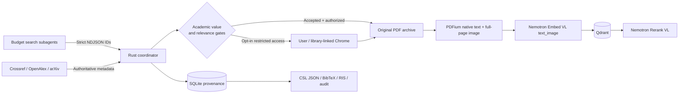

# Academic Literature Mining Skill

A citation-complete, agent-assisted scholarly literature mining system built in
Rust. It discovers academically valuable papers, verifies persistent identifiers,
downloads authorized PDFs, optionally hands subscription PDFs off through a
lawful user or browser-assisted library workflow, indexes complete PDF pages as
native text plus page images with NVIDIA Nemotron, and stores retrievable evidence
in Qdrant.

## Why this project exists

Most literature-search agents optimize for finding plausible titles. That is not
enough for research. This project treats every search result as untrusted until it
has been resolved through a scholarly metadata source and passed explicit quality,
relevance, retraction, citation-completeness, and full-text authorization checks.

Key properties:

- Pure Rust runtime with PDFium-native text and page-image preparation.
- Budget-model subagents perform bounded, read-only candidate discovery.
- Crossref, OpenAlex, arXiv, and optional Semantic Scholar enrichment.
- NVIDIA Build hosted inference with:
  - `nvidia/llama-nemotron-embed-vl-1b-v2`
  - `nvidia/llama-nemotron-rerank-vl-1b-v2`
- Digital PDF pages use their embedded native text plus a complete rendered page
  image; pages without usable text automatically use image-only input.
- Original PDFs, checksums, license assertions, raw metadata, and provenance are
  preserved.
- Deliberate paywalled discovery and retention are disabled by default and use a
  resumable publisher-link handoff, optionally assisted DOI-by-DOI by an authorized
  existing Chrome session.
- Each paper gets an isolated Compose project, private Qdrant service and volume,
  host workspace, SQLite database, and corpus-scoped vector IDs.
- CSL JSON, BibTeX, RIS, canonical JSONL, and corpus audits are exported.
- SQLite-backed resumable stages make large corpus runs recoverable.

## Architecture



Search workers never receive NVIDIA or Qdrant credentials and never download
papers. The Rust coordinator independently resolves every persistent identifier
before a record can enter the corpus.

## Requirements

- Docker with Docker Compose for the prebuilt CLI and bundled Qdrant
- Alternatively, [Rust stable](https://www.rust-lang.org/tools/install) `1.97.1`
  or newer, with Cargo, Clippy, and rustfmt, for a native CLI build
- An [NVIDIA Build](https://build.nvidia.com/) API key
- An OpenAlex API key for OpenAlex discovery and OpenAlex-only identifier
  resolution
- A contact email for polite Crossref requests

`rust-toolchain.toml` pins the same Rust release used by the Docker builder. Rust
is not required on the host when using the prebuilt image. For a native build
installed through rustup, install the declared toolchain before building:

```bash
rustup toolchain install 1.97.1 --profile minimal --component clippy,rustfmt
```

## Quick start

```bash
PROJECT_SLUG=paper-a
test ! -e "projects/$PROJECT_SLUG"
mkdir -p "projects/$PROJECT_SLUG"
cp .env.example "projects/$PROJECT_SLUG/.env"
cp assets/research-plan.example.json "projects/$PROJECT_SLUG/research-plan.json"
```

Replace `paper-a` with a unique slug for this paper. Edit only
`projects/<slug>/.env`, set `LITMINE_PROJECT` to the same slug, and set at least:

```dotenv
LITMINE_PROJECT=paper-a
NVIDIA_API_KEY=your-nvidia-build-key
OPENALEX_API_KEY=your-openalex-key
CONTACT_EMAIL=you@example.edu
QDRANT_API_KEY=use-a-long-random-secret
```

Get the NVIDIA key from <https://build.nvidia.com/settings/api-keys> and the
OpenAlex key from <https://openalex.org/settings/api>. `QDRANT_API_KEY` is a
locally generated secret for the bundled self-hosted service, not a vendor-issued
token. See [`references/user-interaction.md`](references/user-interaction.md) for
stage-specific setup and safe secret handling.

Do not reuse or copy another paper's project directory. SQLite, PDFs, rendered
pages, and exports stay under `projects/<slug>/`; Compose creates a separate
network, Qdrant container, and volume. See
[`references/project-isolation.md`](references/project-isolation.md).

The recommended path pulls the exact published image version declared in
`.env.example`; it does not use `latest`. Verify that the matching `vX.Y.Z`
release exists under the canonical repository's GitHub Releases before pulling:

```bash
docker compose --env-file "projects/$PROJECT_SLUG/.env" pull litmine
docker compose --env-file "projects/$PROJECT_SLUG/.env" up -d qdrant
docker compose --env-file "projects/$PROJECT_SLUG/.env" run --rm --no-deps \
  litmine --version
```

Validate the container, its preinstalled PDFium cache, and Qdrant:

```bash
docker compose --env-file "projects/$PROJECT_SLUG/.env" run --rm litmine \
  doctor --check-qdrant
docker compose --env-file "projects/$PROJECT_SLUG/.env" run --rm litmine \
  init --workspace /workspace
```

Run the example research plan:

```bash
docker compose --env-file "projects/$PROJECT_SLUG/.env" run --rm litmine \
  mine --plan /workspace/research-plan.json \
  --workspace /workspace --max-candidates 1000
```

For native mode, run `cargo build --release --locked`, then follow
[INSTALL.MD](INSTALL.MD) to authorize the one-time PDFium preparation and invoke
`target/release/litmine` directly.

## Agent installation

Read [INSTALL.MD](INSTALL.MD) when installing this project as an agent skill.

The repository intentionally provides a portable contract rather than inventing a
runtime-specific subagent manifest:

- `assets/subagent-manifest.example.json`
- `assets/subagent-task.schema.json`
- `assets/subagent-result.schema.json`
- `assets/search-subagent-prompt.md`

The installing agent must inspect its own runtime's authoritative manifest schema
and translate this contract into the native format. The contract selects the
lowest-cost model that supports web/API reads and strict JSON output, disables
automatic model upgrades, limits concurrency, denies secret inheritance, and
restricts filesystem writes to the assigned result spool.

Import verified worker output:

```bash
cargo run --release --locked -- \
  --env-file "projects/$PROJECT_SLUG/.env" \
  import-agent-results "projects/$PROJECT_SLUG/inbox/candidates.ndjson" \
  --workspace "projects/$PROJECT_SLUG"
```

Malformed or unverifiable candidates are rejected. A candidate must contain at
least one valid DOI, arXiv ID, or OpenAlex work ID.

## Research plans

Start from `assets/research-plan.example.json`. A plan defines:

- the research question and query variants;
- explicit inclusion and exclusion criteria;
- accepted date range, languages, and sources;
- whether preprints are eligible;
- whether paywalled records are eligible for a manual handoff (`include_paywalled`);
- whether an already authenticated library-linked Chrome session may resolve
  pending DOIs (`use_google_scholar_library_access`);
- minimum academic-value and relevance scores;
- corpus size and discovery stopping limits.

The default `min_relevance_score` is `0.0`: Nemotron relevance scores rank records
but do not act as an uncalibrated absolute acceptance gate. Set a nonzero value
only after calibrating the exact screening query with labeled positive and negative
examples. The canonical record preserves both the raw reranker logit and the
sigmoid-normalized score.

Every discovery or screening run preserves the normalized active plan and an
immutable, content-addressed copy under `projects/<slug>/metadata/plans/`.

## Pipeline commands

The full `mine` command runs every stage. Each stage can also be resumed
independently:

```bash
target/release/litmine --env-file "projects/$PROJECT_SLUG/.env" discover --plan "projects/$PROJECT_SLUG/research-plan.json" --workspace "projects/$PROJECT_SLUG"
target/release/litmine --env-file "projects/$PROJECT_SLUG/.env" refresh-metadata --workspace "projects/$PROJECT_SLUG"
target/release/litmine --env-file "projects/$PROJECT_SLUG/.env" screen --plan "projects/$PROJECT_SLUG/research-plan.json" --workspace "projects/$PROJECT_SLUG"
target/release/litmine --env-file "projects/$PROJECT_SLUG/.env" download --workspace "projects/$PROJECT_SLUG"
target/release/litmine --env-file "projects/$PROJECT_SLUG/.env" render --workspace "projects/$PROJECT_SLUG"
target/release/litmine --env-file "projects/$PROJECT_SLUG/.env" ingest --workspace "projects/$PROJECT_SLUG"
target/release/litmine --env-file "projects/$PROJECT_SLUG/.env" export --workspace "projects/$PROJECT_SLUG"
target/release/litmine --env-file "projects/$PROJECT_SLUG/.env" audit --workspace "projects/$PROJECT_SLUG"
target/release/litmine --env-file "projects/$PROJECT_SLUG/.env" status --workspace "projects/$PROJECT_SLUG"
```

With `include_paywalled: true`, `download` returns a `manual_downloads` array for
works it cannot fetch automatically. Each entry contains official publisher/DOI
links, an exact path under `projects/<slug>/pdfs/`, and—when separately enabled—a Google
Scholar DOI query URL. The user can place the PDF themselves, or an authorized
existing `chrome-devtools` MCP can follow visible Scholar library links one DOI at
a time. Rerunning `download` validates the regular non-symlink PDF, records its
SHA-256 and manual provenance, and advances it from `awaiting-manual-download` to
`downloaded` before `render`, `ingest`, `audit`, and `export` resume.

Chrome DevTools MCP remains outside this repository. The agent may install it at
user scope only after explicit authorization and must use proto-managed Node/npm;
otherwise it provides setup guidance and falls back to the manual handoff. See
[`references/chrome-library-access.md`](references/chrome-library-access.md).

`refresh-metadata` re-resolves DOI-backed arXiv preprints through Crossref. When
Crossref verifies a journal article or archival conference paper, its type,
venue, publisher, publication date, volume, issue, pages, and DOI landing URL
become canonical; the arXiv ID, richer abstract, authorized PDF, and source
provenance remain attached. Promoted `rejected` records return to `discovered` so
they can be screened again. The `screen` command automatically runs the same
refresh before applying its hard preprint gate.

To migrate an existing workspace, run:

```bash
target/release/litmine --env-file "projects/$PROJECT_SLUG/.env" refresh-metadata --workspace "projects/$PROJECT_SLUG"
target/release/litmine --env-file "projects/$PROJECT_SLUG/.env" screen --plan "projects/$PROJECT_SLUG/research-plan.json" --workspace "projects/$PROJECT_SLUG"
```

For a workspace created before per-paper isolation, first follow
[`references/project-isolation.md`](references/project-isolation.md): place it in
one `projects/<slug>/`, run `init` once to assign `corpus_id`, and re-ingest queued
pages into `academic_literature_v2` before querying.

To upgrade pages created by an older image-only version, explicitly rebuild and
re-ingest them once:

```bash
target/release/litmine --env-file "projects/$PROJECT_SLUG/.env" render --refresh-existing --workspace "projects/$PROJECT_SLUG"
target/release/litmine --env-file "projects/$PROJECT_SLUG/.env" ingest --workspace "projects/$PROJECT_SLUG"
```

Search the multimodal page corpus:

```bash
target/release/litmine --env-file "projects/$PROJECT_SLUG/.env" query \
  "What evidence supports citation-faithful scientific question answering?" \
  --workspace "projects/$PROJECT_SLUG" \
  --top-k 20 --candidate-limit 80
```

Retrieval embeds the text question, retrieves candidate pages from Qdrant, and
reranks the same native-text-plus-image page representations. Returned results
include the work ID, one-based PDF page number, canonical citation, original PDF
path and URL, SHA-256, and license metadata.

Query live relational metadata without scanning exports:

```bash
target/release/litmine catalog \
  --workspace "projects/$PROJECT_SLUG" \
  --status indexed \
  --year-from 2020 \
  --min-quality-score 65 \
  --limit 50

target/release/litmine inspect-work \
  'doi:10.1234/example' \
  --workspace "projects/$PROJECT_SLUG"
```

Use `query` for evidence by meaning, `catalog` for structured filters, and
`inspect-work` for the canonical metadata and provenance of a known result.
`catalog` and `inspect-work` query `state.sqlite3` through the Rust runtime; they
never read exported JSON or JSONL. See
[`references/query-routing.md`](references/query-routing.md) for the mandatory
agent query policy.

## Academic-value policy

Hard exclusions include:

- retracted, withdrawn, or paratext records;
- unsupported publication types;
- missing title, identifiable authorship, or publication year;
- invalid persistent identifiers;
- disallowed language, date range, or preprint status;
- missing independently authorized PDF unless the plan explicitly enables the
  manual paywalled-PDF workflow;
- quality or relevance below the research-plan thresholds.

A missing public abstract is incomplete metadata, not a hard rejection. The runtime records
`screening-abstract-unavailable:+0` and performs conservative title/year/type/venue triage. For a
paywalled record, obtain and validate the user-authorized PDF before using it as evidence. Existing
records rejected only for this reason can be recovered by upgrading, rerunning `screen` with the
preserved plan, and then running `download`; discovery does not need to be repeated.

The 0–100 quality score combines scholarly type, persistent identifiers, metadata
completeness, age-normalized citations, field-normalized signals, influential
citations, evidence-synthesis markers, and authorized full text. Final priority is:

```text
0.55 × Nemotron relevance + 0.45 × academic-value score
```

This score is research triage, not proof of truth or methodological validity. A
publishable systematic review still requires human appraisal with an
appropriate field-specific instrument. See
[references/quality-policy.md](references/quality-policy.md).

## PDF handling

The original PDF is always retained as the source artifact. PDFium prepares two
aligned representations for each one-based page: its embedded native text layer
and a JPEG rendering of the complete page. Digital pages are embedded with
`modality: "text_image"` and reranked with both `text` and `image`, preserving the
visual layout, tables, charts, formulas, and figures that plain extraction loses.

Pages without a usable native text layer, including scanned pages, automatically
fall back to image-only embedding and reranking. The pipeline performs no OCR and
does not split pages into semantic text chunks. Extracted text is retrieval
metadata, not a citation source; always verify quotations in the preserved PDF.

The NVIDIA Embed and Rerank model APIs do not accept an `application/pdf` payload.
They accept text and base64 image data URLs, so the complete page rendering remains
the required visual input. Each decoded page image is checked against NVIDIA's
25 MiB limit.

## Preserved citation and provenance data

The canonical work record preserves:

- DOI, OpenAlex, arXiv, PubMed, and Semantic Scholar identifiers when available;
- ordered authors, ORCID values, affiliations, and source IDs;
- complete publication date information;
- work type, venue, publisher, volume, issue, pages, and article number;
- ISSN, ISBN, language, keywords, and subjects;
- citation metrics and quality decisions;
- full-text candidates, version, license, and authorization evidence;
- metadata source names, source IDs, retrieval timestamps, and raw provider
  responses;
- original PDF URL, local path, SHA-256, page-level native text, and rendered-image
  checksums.

Every Qdrant page payload duplicates the workspace `corpus_id`, local `page_id`,
canonical CSL citation, and complete work record. Qdrant point UUIDs are scoped by
`corpus_id`, and every query applies that exact filter, so one corpus cannot
overwrite or retrieve another corpus's pages even on an intentionally shared
Qdrant server.

Exports are written under `projects/<slug>/exports/`:

| File | Purpose |
| --- | --- |
| `library.csl.json` | CSL processors and reference managers |
| `library.bib` | LaTeX and BibLaTeX |
| `library.ris` | RIS-compatible reference managers |
| `records.jsonl` | Lossless canonical corpus exchange |
| `citation-audit.json` | Missing citation-field review |
| `corpus-audit.json` | Provenance, PDF checksum, page-count, and indexing audit |

These files are export and interchange artifacts, not live retrieval indexes.
Do not scan them to answer research questions; use Qdrant-backed `query` and
SQLite-backed `catalog` or `inspect-work`.

Always re-open the preserved original PDF before quoting a passage in a
manuscript.

## Security and access controls

- Container mode publishes no Qdrant host ports; each paper uses a private Compose
  network and project-scoped volume. Native mode has a separate opt-in override
  that binds one unique port to `127.0.0.1` only.
- Qdrant requires an API key.
- The CLI image runs without Linux capabilities, uses a read-only root filesystem
  under Compose, and reads secrets only at runtime from the selected project's
  `.env`.
- Search subagents do not inherit coordinator environment variables.
- Download redirects are checked and local/private-address targets are blocked.
- Only openly licensed, open-access asserted, or recognized public-repository
  PDFs are eligible for automatic direct download.
- User-supplied or library-assisted subscription PDFs require explicit opt-in,
  lawful access, and permission for configured external processing. They are
  recorded as `user-supplied; reuse rights not established` and not redistributed.
- Crossref TDM links alone are not treated as proof of open access.
- Sci-Hub, access-control bypasses, and paywall scraping are explicitly excluded.
- Secrets belong only in `projects/<slug>/.env`; the entire `projects/` tree is
  ignored by Git.

## Development

```bash
cargo fmt --all -- --check
cargo clippy --all-targets --locked -- -D warnings
cargo test --all-targets --locked
cargo build --release --locked
```

CI repeats those checks and builds the container on pull requests and `main`.
Pushing an authorized `vX.Y.Z` tag publishes attested Linux `amd64`/`arm64`
images and then creates the matching GitHub Release. See
[`references/release-process.md`](references/release-process.md); do not create a
tag or change package visibility without explicit repository-owner approval.

The PDF text-image preparation test is ignored during ordinary offline test runs
because it requires a prepared native PDFium library. `doctor --prepare-pdfium`
prepares it; the test can then be run explicitly with `PDFIUM_LIB_PATH`.

## Project status

This is a pre-1.0 research tool. Review corpus audits, source coverage, licenses,
and field-specific methodological quality before using results in a publication.

## License

Copyright 2026 Ruisi Lu.

Licensed under the [Apache License, Version 2.0](LICENSE).
